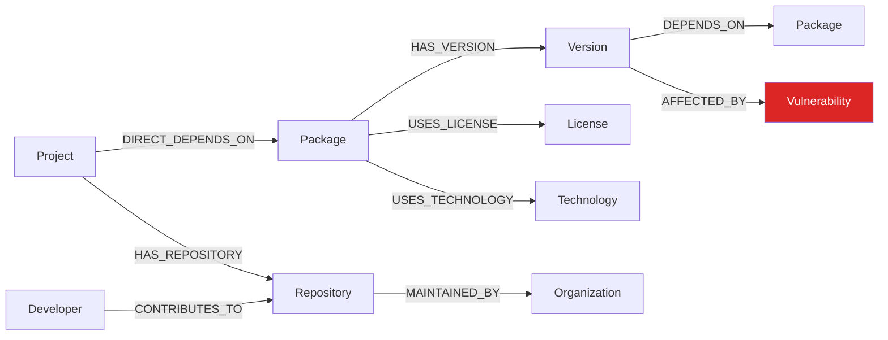
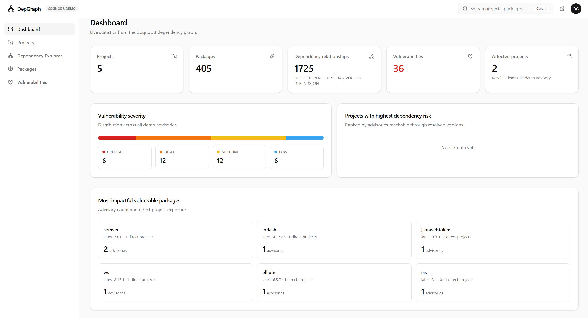
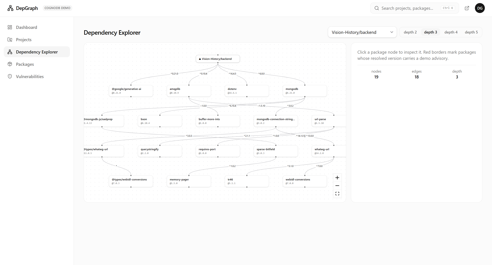
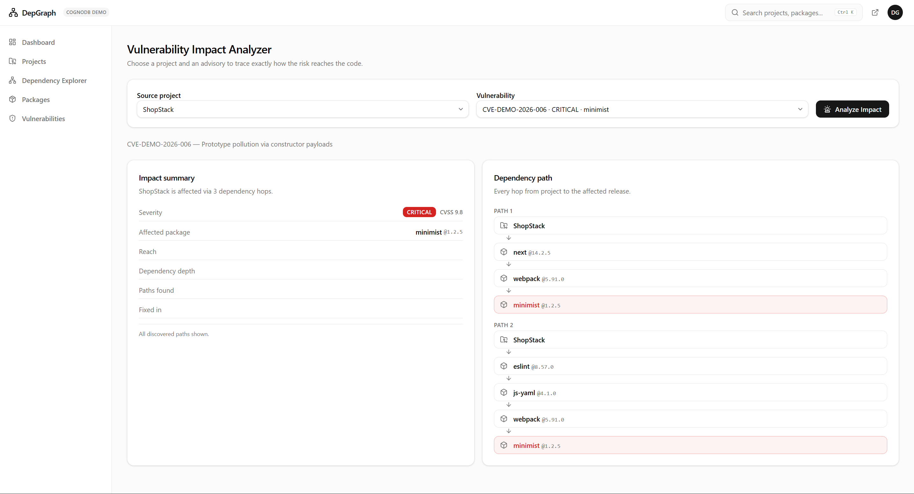
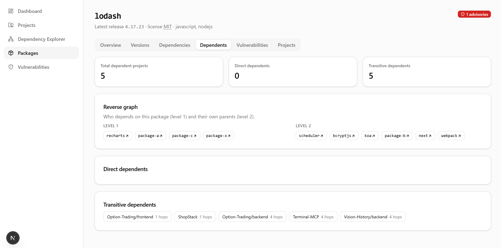

# DepGraph — Open-Source Dependency Risk Graph

DepGraph is a dependency intelligence and vulnerability analysis platform backed by
**CognoDB**, a managed graph database that speaks **openCypher over Bolt** (accessed here with
the official `neo4j-driver`). It answers one deceptively hard question:

> **Is my project affected by a vulnerable dependency — and exactly how does that vulnerability
> reach my project?**

```text
ShopStack ▸ next ▸ webpack ▸ package-x ▸ lodash@4.17.21 ▸ CVE-DEMO-2026-001
```

Built as a technical take-home assignment: deterministic seed data, meaningful multi-hop
traversals, parameterized Cypher everywhere, graceful database failure handling, polished UI,
tests, and this README. Plain JavaScript throughout (no TypeScript).

---

## 🚀 Live Demo

**[Open DepGraph →](https://depgraph-tqa1.onrender.com)**

#### Video demo

[](https://youtu.be/NEyoGOVgZXg)

> The demo dataset uses synthetic `CVE-DEMO-*` advisories to demonstrate graph traversal and
> vulnerability impact analysis. No real vulnerability data.

---

## The problem

Modern applications depend on hundreds of packages, which depend on other packages, which
depend on others still. A single vulnerable release buried four levels deep — reachable only
through a transitive chain like `next → webpack → package-x → lodash` — is invisible to flat
dependency lists:

- Flat manifests (`package.json`) show **direct** dependencies only.
- Lockfiles show *what* got installed but make "who is exposed to CVE X?" a manual hunt.
- Security tools flag versions, but rarely explain **the path** the risk travels — or whether a
  patched pin already shields you.

DepGraph makes the whole chain queryable, traversable in both directions, and visual.

## Why a graph database?

The domain *is* a graph, so the core questions become short traversals instead of recursive
joins:

```text
Project ──DIRECT_DEPENDS_ON──▶ Package ──HAS_VERSION──▶ Version ──DEPENDS_ON──▶ Package …
                                                        │
                                                        └──AFFECTED_BY──▶ Vulnerability
```

- **Variable-depth traversal**: "every package this project transitively depends on" is a
  bounded variable-length pattern (`DEPENDS_ON*0..8`) or a level-by-level BFS — no schema-wide
  recursive CTE gymnastics, no join tables that grow quadratically with depth.
- **Reverse analysis**: "which projects are exposed if lodash turns vulnerable?" is the same
  pattern read backwards. In a relational model this means walking every project's dependency
  tree at query time; in a graph the edges already exist.
- **Version as a first-class node**: `lodash` has both `4.17.21` (vulnerable) and `4.17.23`
  (patched) as separate nodes with their own `AFFECTED_BY` edges. Projects that pin different
  releases get *different answers from the same structure* — no conditional logic scattered in
  application code.
- **Multi-path evidence**: when two independent chains reach the same CVE (ShopStack reaches
  lodash via `next` AND via `recharts@2.12.2`), paths enumerate naturally for explanations.

## Architecture

```text
┌─────────────────────────────── Browser ──────────────────────────────�[...]
│  Next.js App Router (React 19)                                            │
│   • Server Components read via lib/queries/* (never lib/db directly)      │
│   • Client components (Explorer, Analyzer, Search…) call REST APIs        │
│   • React Flow canvas · shadcn-style UI · Tailwind v4 · Lucide            │
└───────────────┬───────────────────────────────────────┬────────�[...]
                │ fetch /api/*                          │ RSC data calls
┌───────────────▼───────────────────────────────────────▼────────�[...]
│  Route Handlers (app/api/*)          lib/queries/*                        │
│   validation · error mapping          traversal.js (BFS engine)           │
│   = thin HTTP shells                  dependencies.js (impact/paths)      │
│                                       dashboard/projects/packages/…       │
├────────────────────────────────────────────────────────────────�[...]
│  lib/db.js — neo4j-driver singleton                                       │
│   parameterized sessions · RETURN 1 health probe · typed error mapping    │
└───────────────────────────────┬────────────────────────────────[[...]
                                │ Bolt (bolt+s://)
                    ┌───────────▼────────────┐
                    │        CognoDB         │
                    │  openCypher · indexes  │
                    └────────────────────────┘
```

Key rule enforced throughout: **only `lib/db.js` touches the driver**, only `lib/queries/*`
write Cypher, and React components never import either directly (client components go through
the REST layer).

## Data model



**Why `Version` is a node, not a string property** — the heart of the model:

```text
lodash ──HAS_VERSION──▶ lodash@4.17.21 ──AFFECTED_BY──▶ CVE-DEMO-2026-001
       ──HAS_VERSION──▶ lodash@4.17.23            (no edge: patched)
```

Resolution semantics ride on relationship properties:

| Relationship | Properties | Meaning |
| --- | --- | --- |
| `DIRECT_DEPENDS_ON` | `versionSpec`, `resolvedVersion` | what `package.json` declared → what the lockfile resolved |
| `DEPENDS_ON` | `range`, `resolvedVersion` | a *specific release's* dependency on a package |
| `CONTRIBUTES_TO` | `commits` | developer activity for repo stats |

The canonical **resolved-version gate** used across queries:

```cypher
WHERE (d.resolvedVersion IS NULL AND v.isLatest) OR v.number = d.resolvedVersion
```

…so FinTrack (pins `axios@0.21.1`) is flagged vulnerable while ShopStack (`axios@^1.6.2`) is
clean — same graph, different pins, correct answers.

## Features

1. **Dashboard** — live counts, severity distribution, most impactful vulnerable packages,
   highest-risk projects.
2. **Project Explorer** — direct vs transitive counts, advisories with severity chips,
   direct-dependency table showing `specified → resolved` with safe/vulnerable status.
3. **Dependency Graph Explorer** — React Flow canvas, depth control (2–5), progressive expansion
   under hard node caps, click-to-inspect panel, red borders on vulnerable nodes, one-click
   **Trace dependency path** that highlights edges.
4. **Vulnerability Impact Analyzer** *(flagship)* — pick project × advisory → severity/CVSS,
   affected package@version, direct-vs-transitive verdict, hop count, number of paths, and the
   actual path(s) as steppers.
5. **Dependency Path Finder** — shortest chain plus alternate multi-path routes.
6. **Reverse Dependency Analysis** — direct/transitive dependents + layered reverse
   neighborhood visualization per package.
7. **Package Intelligence** — tabs: Overview · Versions · Dependencies · Dependents ·
   Vulnerabilities · Projects.
8. **Global Search** — ⌘K/Ctrl-K palette over projects, packages and advisories.
9. **GitHub Import** — paste a public repo URL; parses `package.json` + lockfiles (v1/v2/v3),
   MERGEs an idempotent subgraph into the shared dataset.

## Tech stack

| Layer | Choice | Purpose |
| --- | --- | --- |
| Framework | Next.js 15 (App Router) | server components + route handlers in one deploy |
| UI | React 19, Tailwind CSS v4, shadcn-style components, Lucide | developer-tool aesthetic, zero Radix bloat |
| Graph viz | `@xyflow/react` (React Flow) | pan/zoom canvas, custom nodes, edge highlighting |
| Database driver | official `neo4j-driver` | CognoDB speaks openCypher over Bolt |
| Database | CognoDB | managed property graph; constraints/indexes via Cypher |
| Tests | Vitest (+ Playwright) | deterministic unit tests; live query tests skip without DB |

## Setup

1. **Create a CognoDB account** at cognodb.io and provision a free instance.
2. Copy the instance's **Bolt URI**, username and password from the console
   (URI looks like `bolt+s://<tenant>.cognodb.io:7687`).
3. Configure environment:

   ```bash
   cp .env.example .env.local
   # COGNODB_URI=bolt+s://….cognodb.io:7687
   # COGNODB_USERNAME=cognodb
   # COGNODB_PASSWORD=…
   ```

4. Install dependencies and run:

   ```bash
   npm install
   npm run seed     # applies schema, wipes managed labels, loads deterministic demo data
   npm run dev      # http://localhost:3000
   ```

`npm run reset` clears all DepGraph-managed labels (anything else in the instance is untouched);
re-running `seed` always produces the identical graph (fixed-seed PRNG + full wipe before insert).

## Environment variables

See [`.env.example`](.env.example):

```env
COGNODB_URI=
COGNODB_USERNAME=cognodb
COGNODB_PASSWORD=
# COGNODB_DATABASE=neo4j   # optional
```

Secrets are read **server-side only** (`lib/db.js`); nothing database-related reaches the browser
bundle, and `.env*.local` is git-ignored.

## Cypher queries

The full annotated reference lives in [`cypher/examples.cypher`](cypher/examples.cypher); the
executable implementations live in `lib/queries/*`. Highlights:

| Query | Where | Why it's graph-native |
| --- | --- | --- |
| Direct dependencies | `projects.js` | one hop from the project; properties carry spec → resolution |
| Transitive closure | `traversal.js` + Query 2 in examples | variable-length `DEPENDS_ON*0..8` — no recursive joins |
| Vulnerability impact paths | `dependencies.js · impactOfVulnerability` | exact BFS with the resolved-version gate per hop; enumerates *all* routes to a CVE |
| Reverse dependents | `dependencies.js · findDependents` | same pattern read backwards; `min(length(path))` separates direct from transitive |
| Shortest path | examples Query 5 (`shortestPath`) | O(hops) instead of N recursive CTEs |
| Dashboard stats | `dashboard.js` | counts chained via `WITH`, single round-trip |
| Global search | `search.js` | categorized `UNION ALL` over three labels |

**Two traversal styles, on purpose.** openCypher's variable-length patterns can't carry a
per-step "use the lockfile-resolved version" condition, so:

- *Package-granularity questions* ("which projects touch lodash?", "shortest route to a
  package?") use native variable-length MATCHes — fast, single query.
- *Version-exact questions* (impact analyzer, path enumeration) drive hop-by-hop BFS from the
  server: each level is one small parameterized expansion under hard depth/node caps.

That trade-off is documented rather than hidden — it keeps answers exact while staying portable
across openCypher engines.

**Safety rule:** every query uses `$parameters`. User input never touches Cypher text — enforced
by funneling everything through `runQuery(query, params)` and validated again at the API edge
(`lib/api.js · requireString/intParam`, URL pattern check for GitHub import).

## Testing

```bash
npm test          # Vitest: dataset determinism/scenarios + live query tests*
npm run test:e2e  # Playwright: §34 walkthrough (auto-skips if app/DB is down)
```

\* Live query tests connect to real CognoDB when credentials exist and otherwise print a notice
and skip, so CI stays green offline. Covered: project lookup, transitive traversal, impact
analysis (affected *and* patched-pin cases), multi-path finding, reverse dependents,
pagination/filtering, search.

## 📸 Screenshots

### Dashboard


### Dependency Graph Explorer


### Vulnerability Impact Analyzer


### Reverse Dependency Analysis


## Deployment

DepGraph is a standard Next.js application deployable to any Node-compatible platform.

**Current production deployment:** https://depgraph-tqa1.onrender.com (hosted on Render)

### Environment variables

```env
COGNODB_URI=
COGNODB_USERNAME=cognodb
COGNODB_PASSWORD=
```

Database credentials are read **server-side only** (`lib/db.js`); nothing database-related reaches
the browser bundle, and `.env*.local` is git-ignored.

## Project structure

```text
├── app/
│   ├── page.jsx                 # landing
│   ├── (main)/                  # product shell (sidebar + search)
│   │   ├── dashboard/ explorer/ analyzer/ path-finder/
│   │   ├── projects/[id]/ packages/[id]/ vulnerabilities/[id]/ import/
│   └── api/                     # thin Route Handlers over lib/queries
├── components/                  # layout · graph · shared · ui primitives
├── data/                        # deterministic dataset tables + assembler
├── lib/
│   ├── db.js admin.js api.js errors.js env.js severity.js
│   ├── queries/                 # traversal engine + feature query modules
│   └── import/github.js         # repository importer
├── scripts/ seed.js reset.js check-dataset.js
├── cypher/ schema.cypher examples.cypher
├── tests/ dataset.test.js queries.test.js e2e/demo-flow.spec.js
└── README.md
```

## Scope & Demo Data

DepGraph is focused on dependency graph modeling, traversal, and vulnerability impact analysis
for a technical assessment.

### Demo vulnerability data

All vulnerabilities in the seed dataset are labeled `CVE-DEMO-*` and are **synthetic demonstration
records**, not real CVEs or production vulnerability intelligence.

They exist to demonstrate:

- Vulnerability impact analysis across dependency chains
- Direct vs transitive dependency analysis
- Multi-hop dependency traversal
- Reverse dependency analysis
- Affected vs unaffected package versions based on pinned versions

When you import a real project into DepGraph, it is evaluated against these demo advisories.
**Any match should be interpreted as a demonstration of the analysis pipeline, not as confirmation
of a real-world vulnerability.**

### Deliberately excluded

- Authentication & teams
- Billing
- Private-repository OAuth
- NPM registry mirroring
- AI-based analysis
- Production vulnerability feeds

## License

MIT
